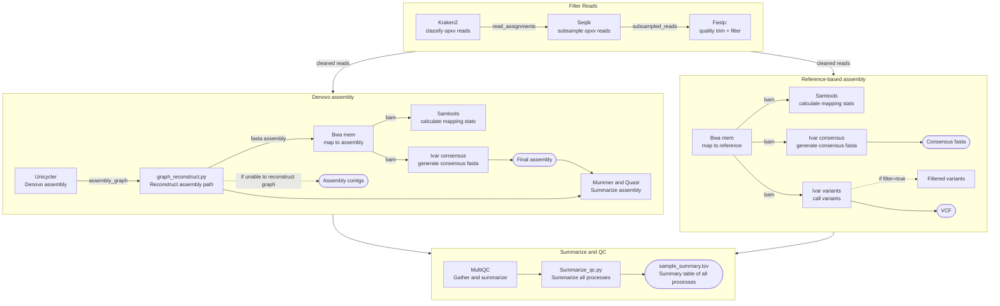

# polkapox

```mermaid
graph TD
  subgraph filter_reads["Filter Reads"]
    kraken2["Kraken2<br>classify opxv reads"]
    seqtk["Seqtk<br>subsample opxv reads"]
    fastp["Fastp:<br>quality trim + filter"]
    kraken2 -- read_assignments --> seqtk
    seqtk -- subsampled_reads --> fastp
  end

subgraph ref_based["Reference-based assembly"]
  direction LR
  bwa["Bwa mem<br>map to reference"];
  samtools["Samtools<br>calculate mapping stats"];
  ivar_cons["Ivar consensus<br>generate consensus fasta"];
  ivar_var["Ivar variants<br>call variants"]
  var_filt[Filtered variants];
  bwa -- bam --> samtools
  bwa -- bam --> ivar_cons
  bwa -- bam --> ivar_var
  ivar_var-."if filter=true".->var_filt
  ref_fasta([Consensus fasta]);
  vcf([VCF]);

  ivar_cons --> ref_fasta
  ivar_var --> vcf
end

  subgraph denovo[Denovo assembly]
    %% Assign the processes (nodes)
    unicycler["Unicycler<br>Denovo assembly"]
    graph_recon["graph_reconstruct.py<br>Reconstruct assembly path"]
    bwa_denovo["Bwa mem<br>map to assembly"]
    samtools_denovo["Samtools<br>calculate mapping stats"]
    ivar_polish["Ivar consensus<br>generate consensus fasta"]
    summarize_asmb["Mummer and Quast<br>Summarize assembly"]

    %% Assign output files
    assembly_fasta(["Final assembly"])
    assembly_contigs(["Assembly contigs"])

    %% Assign the arrows
    %%fastp -- cleaned_reads --> unicycler
    unicycler -- assembly_graph --> graph_recon
    graph_recon -- fasta assembly --> bwa_denovo
    graph_recon -."if unable to reconstruct graph".->  assembly_contigs
    %%fastp -- cleaned_reads --> bwa_denovo
    bwa_denovo -- bam --> samtools_denovo
    bwa_denovo -- bam --> ivar_polish
    ivar_polish --> assembly_fasta
    graph_recon --> summarize_asmb
    assembly_fasta --> summarize_asmb
    end 

  subgraph summarize[Summarize and QC]
    direction LR
    %% Assign the processes (nodes)
    multiqc["MultiQC<br>Gather and summarize"]
    summarizeqc["Summarize_qc.py<br>Summarize all processes"]

    %% Assign output files
    sample_summary(["sample_summary.tsv<br>Summary table of all processes"])

    %% Assign the arrows
    %%assembly_fasta --> multiqc
    %%ref_fasta --> multiqc
    multiqc --> summarizeqc
    summarizeqc --> sample_summary
  end
  
  %% Connect the subworkflows
  filter_reads -- cleaned reads --> denovo
  filter_reads -- cleaned reads --> ref_based
  denovo --> summarize
  ref_based --> summarize
```
